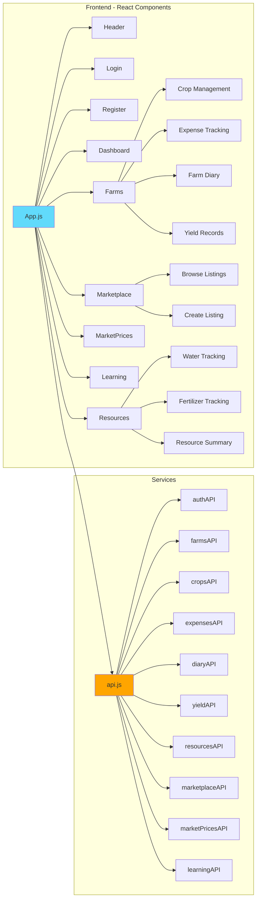
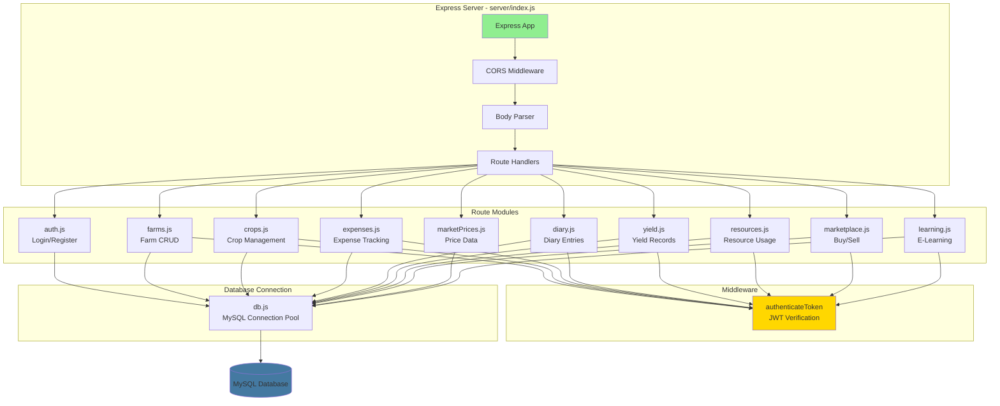
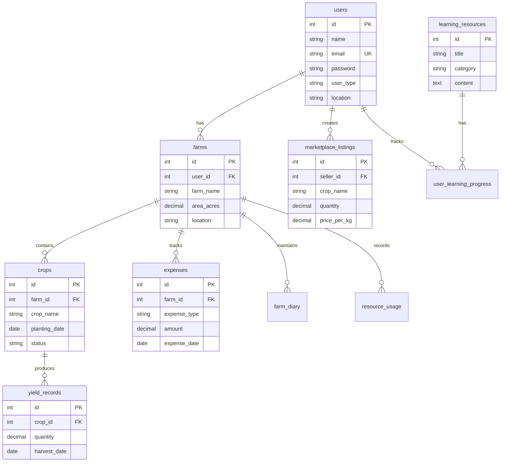
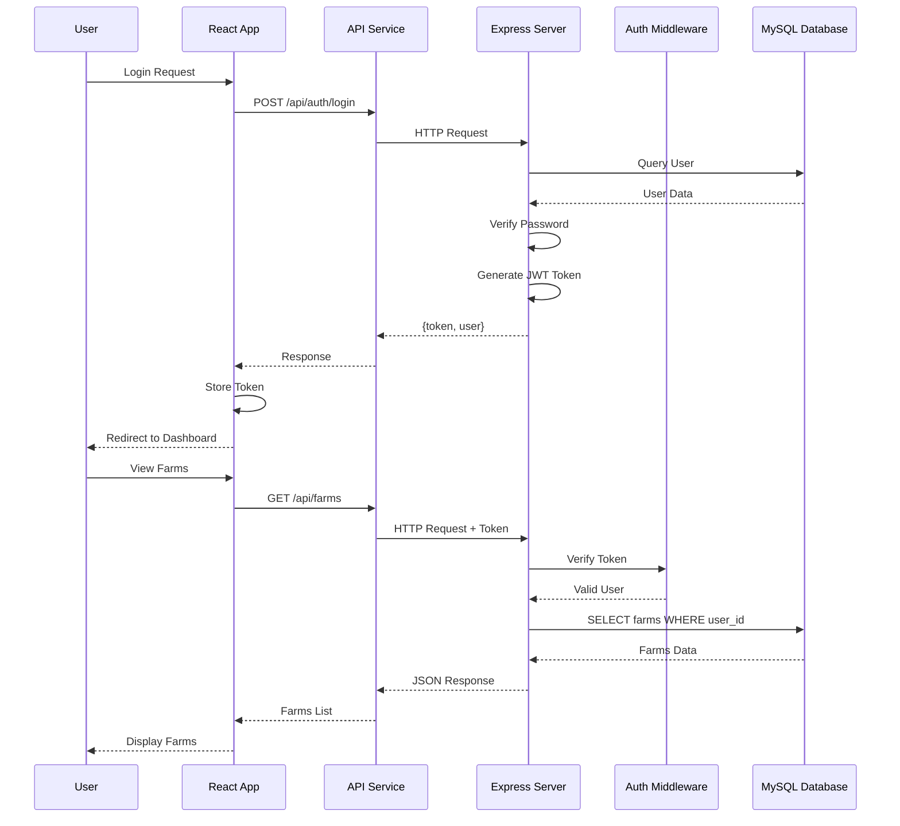
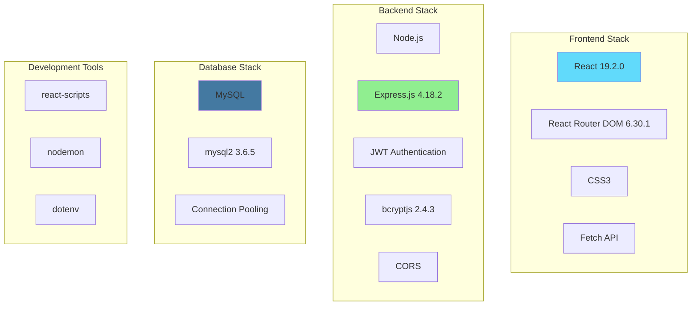
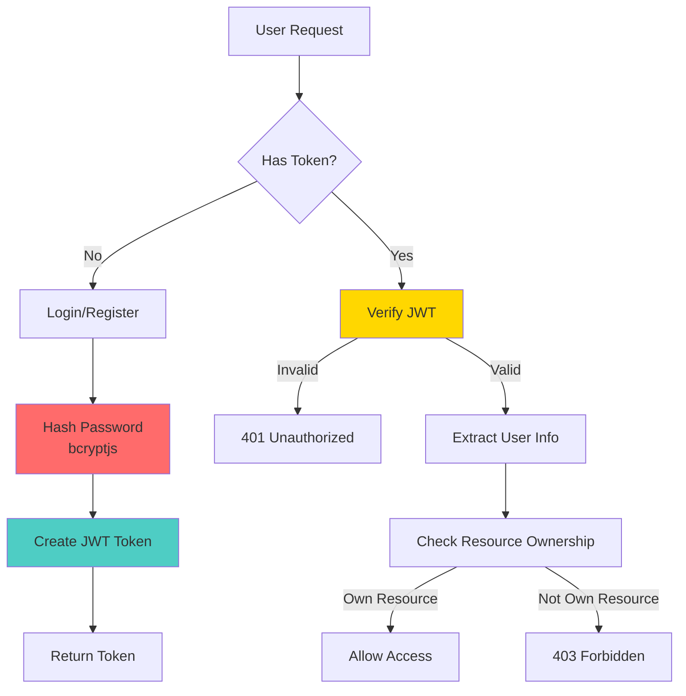
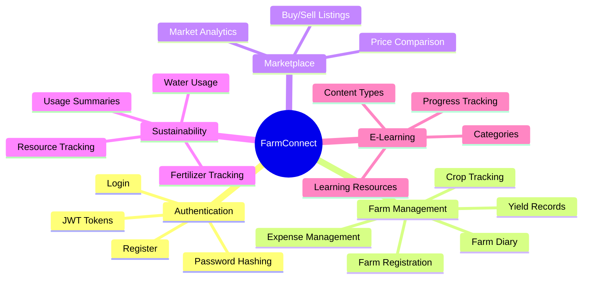
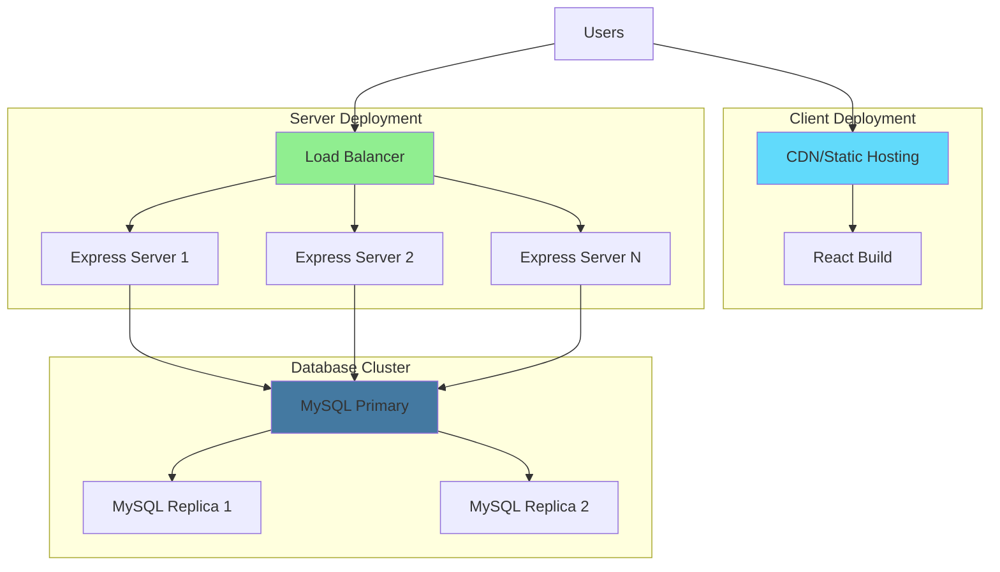

# FarmConnect Architecture Diagram

## System Architecture Overview

```mermaid
graph TB
    subgraph "Client Layer - React.js"
        A[User Browser] --> B[React App<br/>Port 3000]
        B --> C[React Router]
        C --> D[Components]
        D --> E[API Service Layer]
    end
    
    subgraph "Components"
        D1[Login/Register]
        D2[Dashboard]
        D3[Farms Management]
        D4[Marketplace]
        D5[Market Prices]
        D6[Learning Platform]
        D7[Resources Tracking]
    end
    
    subgraph "API Layer - Express.js"
        E --> F[Express Server<br/>Port 5001]
        F --> G[Middleware]
        G --> H[Route Handlers]
    end
    
    subgraph "Authentication"
        G --> G1[JWT Auth]
        G --> G2[bcryptjs]
    end
    
    subgraph "Routes"
        H --> H1[/api/auth]
        H --> H2[/api/farms]
        H --> H3[/api/crops]
        H --> H4[/api/expenses]
        H --> H5[/api/diary]
        H --> H6[/api/yield]
        H --> H7[/api/resources]
        H --> H8[/api/marketplace]
        H --> H9[/api/market-prices]
        H --> H10[/api/learning]
    end
    
    subgraph "Data Layer - MySQL"
        H --> I[MySQL Database<br/>farmconnect]
        I --> I1[users]
        I --> I2[farms]
        I --> I3[crops]
        I --> I4[expenses]
        I --> I5[farm_diary]
        I --> I6[yield_records]
        I --> I7[resource_usage]
        I --> I8[marketplace_listings]
        I --> I9[market_prices]
        I --> I10[learning_resources]
        I --> I11[user_learning_progress]
    end
    
    style A fill:#e1f5ff
    style B fill:#61dafb
    style F fill:#90EE90
    style I fill:#4479A1
    style G1 fill:#FFD700
    style G2 fill:#FFD700
```

## Component Architecture



## Backend Architecture



## Database Schema Relationships



## Data Flow Diagram



## Technology Stack



## Security Architecture



## Feature Modules



## Deployment Architecture (Future)



---

## Architecture Notes

### Frontend Architecture
- **Framework**: React.js with functional components and hooks
- **Routing**: React Router DOM for client-side routing
- **State Management**: React useState and useEffect hooks
- **API Communication**: Centralized API service layer
- **Styling**: CSS3 with modern gradients and responsive design

### Backend Architecture
- **Framework**: Express.js RESTful API
- **Authentication**: JWT-based with bcrypt password hashing
- **Middleware**: CORS, body-parser, custom auth middleware
- **Database**: MySQL with connection pooling
- **Error Handling**: Try-catch blocks with error responses

### Database Architecture
- **RDBMS**: MySQL
- **Connection**: Connection pooling for efficiency
- **Relationships**: Foreign key constraints for data integrity
- **Indexing**: Primary keys and unique constraints

### Security Features
- **Password Security**: bcryptjs hashing (10 rounds)
- **Token Security**: JWT with expiration (7 days)
- **Route Protection**: Authentication middleware
- **Data Validation**: Input validation on both client and server
- **CORS**: Configured for cross-origin requests

### Scalability Considerations
- Connection pooling for database efficiency
- Stateless API design for horizontal scaling
- Modular component architecture
- Separation of concerns (routes, middleware, services)

---

**Note**: These diagrams are in Mermaid format. They can be viewed in:
- GitHub (renders automatically)
- VS Code (with Mermaid extension)
- Online Mermaid editors (https://mermaid.live)
- Documentation tools that support Mermaid

